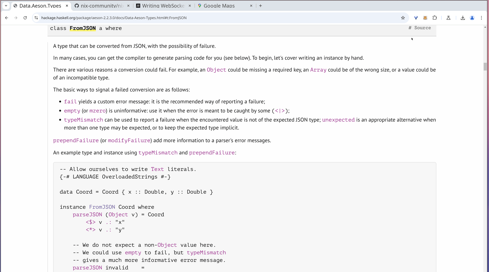

# Stacky - Organize Your Browser Tabs into Stacks


## Overview

If you find yourself overwhelmed with multiple tabs, **Stacky** is here to help. It provides an easy way to manage your browser history by organizing the tabs you’ve visited into "stacks" based on their hostnames.

## Problem

- You’re researching something, and you open multiple tabs from the same website.
- Each tab contains documentation or resources that you need to reference, but it's difficult to keep track of them all.
- With so many tabs open, it’s easy to get lost, confused, or distracted.

Stacky makes managing this chaos easier by grouping your visited pages based on their website, allowing you to revisit them later with ease. You can also pin mostly visited websites to keep them on the top of the list.

## Installation

1. Clone or download the project:
   ```bash
   git clone https://github.com/your-username/stacky.git
   ```

2. Load the extension into your browser:
   - Open Chrome.
   - Go to the Extensions page (`chrome://extensions/`).
   - Enable **Developer Mode**.
   - Click on **Load unpacked** and select the `stacky` folder.
   - The extension will now be active!

## Usage

Once you’ve installed Stacky, it will start recording the links you visit. You can:

- Access your saved "stacks" of tabs through the extension's popup.
- See your history organized by website hostname.
- Click on a stack to quickly navigate to previously visited pages.

There is no option page, all settings are in the popup.

## License

This project is licensed under the MIT License - see the [LICENSE](LICENSE) file for details.
